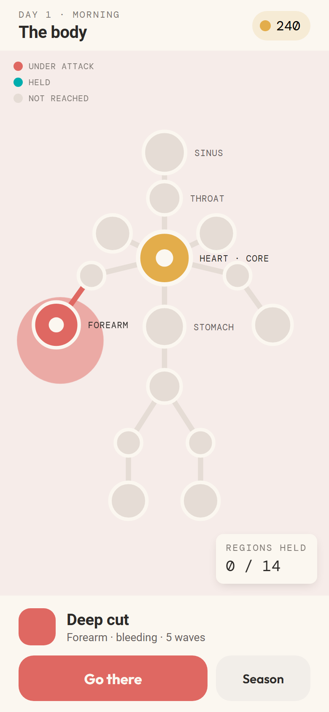
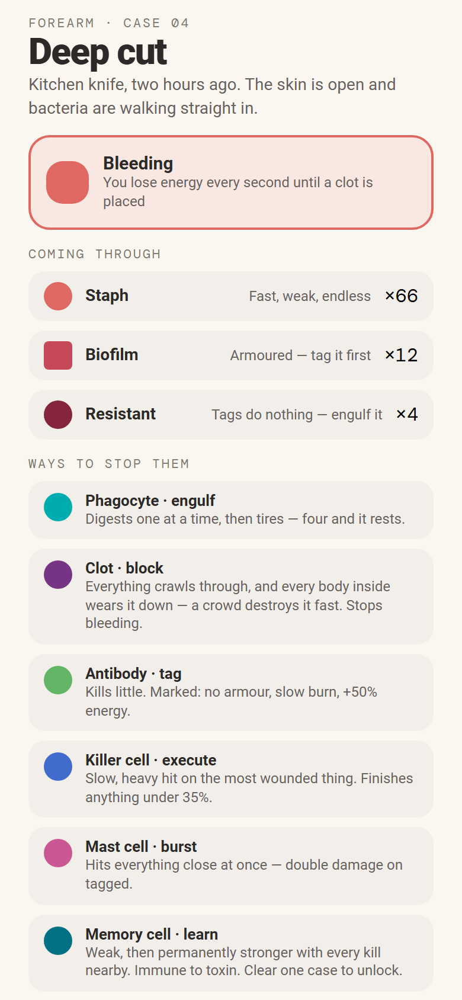
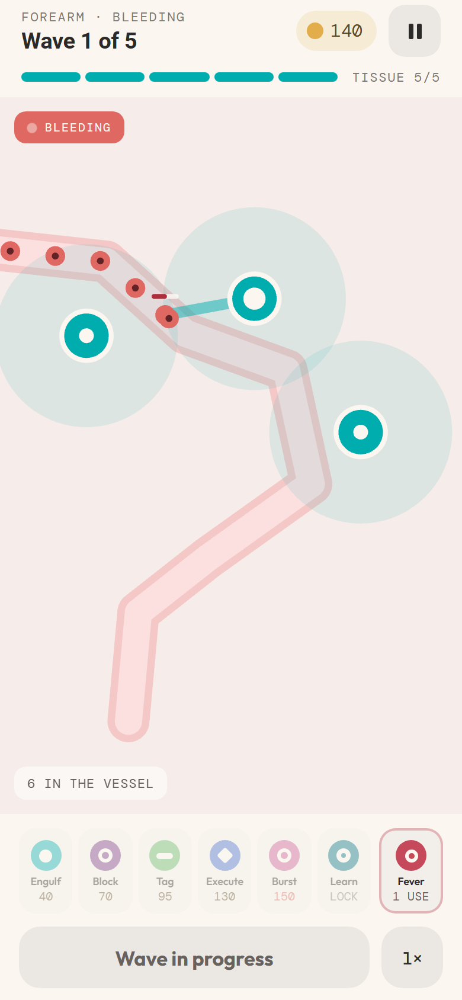
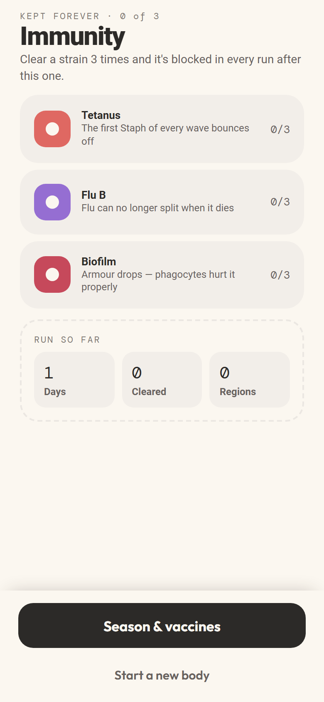
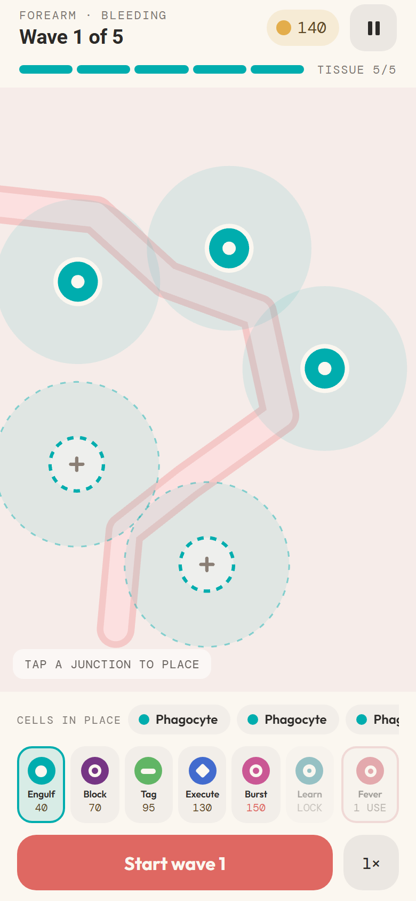
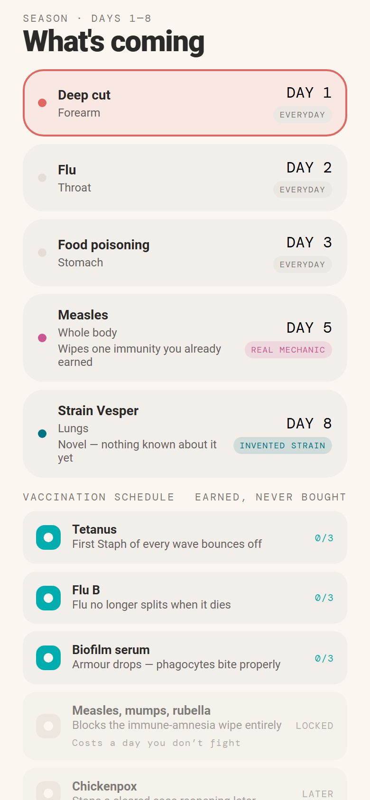

<div align="center">

# Body Defense

**A tower defence played inside the human body.**
Cuts, flu, food poisoning — you place the cells and hold the region.

[**▶ Play it**](https://brendankowitz.github.io/towerdefense-body-game/) · Ionic React · PixiJS · Capacitor

</div>

---

<div align="center">




</div>

---

## The game

Pathogens walk a vessel. You have five junctions to defend it from, a budget that only grows by
killing things, and five pips of tissue between the infection and the heart.

Six cells, each of which targets differently — and that is the whole design, not a stat spread:

| | |
|---|---|
| **Engulf** | Holds one thing at a time, frozen, and digests it. Fills up on what it breaks down, then rests — one big body costs it as much as a crowd of small ones. |
| **Block** | Deals no damage at all. Slows everything, and a crowd tears it apart. |
| **Tag** | Kills little. Marks everything in reach: armour drops, damage burns, kills pay more. |
| **Execute** | One heavy hit on the *most wounded* thing in range. Finishes anything under a threshold. |
| **Burst** | Hits everything close at once, twice as hard on anything tagged. |
| **Learn** | Weak, then permanently stronger with every kill nearby. |

Three of them can be **grown** into a named form — a phagocyte into a macrophage — and every one
is a trade rather than an upgrade. The macrophage bites harder, reaches further and has twice the
appetite, but rests more than twice as long and costs more than twice as much — so per energy
the plain phagocyte is nearly twice as efficient against a stream, and the macrophage earns its
place on the big armoured bodies. That is roughly what macrophages actually do.

Clearing a case three times earns that strain's vaccine, permanently, across every run after.

## Running it

```bash
npm ci
npm run dev        # http://localhost:5173
```

```bash
npm run verify     # lint, both typechecks, 726 unit tests, production build
npm run test:e2e   # 26 Playwright specs against the built app
npm run sweep      # plays every affordable board through the real simulation (~2 min)
npm run sweep:maturation   # the same boards again under three maturation policies (~6 min)
```

## How it is built

**The simulation is pure TypeScript.** No DOM, no React, no Pixi, no browser globals — enforced
by an ESLint boundary *and* by a tsconfig that compiles it against a DOM-free lib. It cannot
reach for `Math.random`, `Math.hypot` or `Date.now` either: the first two make runs
irreproducible, and `hypot` is permitted by spec to be approximated, which would make results
differ between engines.

**It runs on a fixed 1/60s timestep** with a seeded PRNG carried in state, so a run reproduces
byte-for-byte and a 120 Hz phone plays the same game as a 60 Hz browser.

**React stops at the canvas.** Pixi owns the board and is driven imperatively, pooling display
objects per entity; the HUD subscribes to a throttled snapshot through `useSyncExternalStore`.
Nothing on the play surface round-trips through React state.

**Content is tunable, and the tools assume it.** Every cost, range, rate and wave table is data.
A dev-only panel edits them against the *running* simulation and exports a diff against
`content/`. No test asserts a gameplay number — they assert relationships, so a balance pass can
move everything without turning the suite red.

**Balance is measured, not felt.** `npm run sweep` plays every affordable board of every case
through the real simulation and reports the clear rate:

```
forearm  5 cells  |  414/3125 clear (13.2%)  |  best: anti,mast,phago,phago,phago
throat   6 cells  |  486/7776 clear (6.3%)   |  best: anti,anti,anti,phago,phago
stomach  6 cells  |  424/7776 clear (5.5%)   |  best: anti,phago,anti,phago,anti
hand     6 cells  |  411/7776 clear (5.3%)   |  best: anti,mast,mem,phago,phago
```

It fails if a tuning makes a case unwinnable, if a later case becomes easier than the one the
season opens with, or if the curve inverts. Not if one case is easier than the case before it:
a hard case followed by a breather is pacing, and one body moved between waves was measured to
be worth 0.8 points, so a staircase would have been asserting past the instrument's resolution.
`tests/sweep/curve.ts` has the arithmetic and the measurement behind it.

That player buys cells and never grows one. `npm run sweep:maturation` plays the same boards
again under policies that do, and the answer is not the one the harness used to assume. Growing
every cell you can afford once the board is standing takes forearm from 13.2% to **21.8%** and
stomach from 5.5% to **14.0%** — and takes throat *down*, from 6.3% to 5.9%, winning 42 boards
and losing 69. A matured form is a trade, the trade is case-shaped, and there is no policy here
that is simply "playing better". The gate on that run is the band floor, not the ceiling:
growing may make a case harder, and may not make it a case nobody can win.

<div align="center">


</div>

## Layout

```
src/game/      the simulation — pure, deterministic, no DOM
  content/     defenders, pathogens, cases, vaccines, maturation, rules — all tunable data
  systems/     spawn, movement, targeting, damage, hazards, economy, deaths
src/render/    PixiJS board — pooled, procedural flat shapes, no sprite assets
src/app/       Ionic React shell, five screens, HUD
src/progress/  persistence port, localStorage and Capacitor adapters
src/theme/     oklch role tokens — colour is role, never decoration
tests/sweep/   the balance harness
docs/          design spec, implementation plan, holistic review
```

## Where it came from

This began as a Claude Design prototype: five screens, six cells, three cases, and a complete
art direction. It demonstrated every mechanic beautifully — and it could not be won. Before the
balance pass, an exhaustive sweep cleared forearm on 0 of 1024 affordable boards, throat on 0 of
3125, and stomach on 3 of 7776.

Several defects came across with it and are fixed here, each documented at the point of change:
a vaccine that could never be earned, a shield that silently broke on replaying a case, energy
that could settle at −1 behind a display clamp, an enemy that was not frozen until the step after
it was engulfed, and placement that was never gated to the build phase — so a destroyed clot
could be rebuilt mid-wave, turning the wound rule into a pay-as-you-bleed loop.

All seven rules and all ten regions are now authored: bleeding, multiplying, toxic, relapsing,
amnesia, overreaction and one case that tells you nothing at all. Day 9 is the first case played
under two rules at once.

`docs/superpowers/` carries the design spec, the implementation plan, a holistic review of the
finished codebase, the case-rules design the ten cases were built from, and a review of what the
first seven boards had in common.

## Known and open

- **Days 1 to 7 are one board, seven times.** Measured in
  `docs/superpowers/reviews/2026-07-31-season-shape-review.md`: every one of those vessels enters
  off the left edge and leaves through the floor, and their build spots sit within twelve units of
  the same offset. Days 8 to 10 are shaped against that finding; the first seven have not been
  retrofitted, because moving a spot is worth up to eleven points of clear rate and it would be a
  re-tune of the whole season.
- **Poison stacks per enemy in range**, and that was never a decision — it is emergent from a
  loop rather than chosen. Stomach sits at the bottom of the band largely because of it.
- **Maturing is worth measuring per case, and nobody has.** `npm run sweep:maturation` says
  growing everything wins on forearm and loses on throat and stomach, which is a trade working as
  designed — but it does not say which of the three forms is carrying that, and the gate still
  measures a player who never grows.
- **iOS is configured but unverified** — see below.

## Prerequisites

Node 22 or later. No other toolchain is required for the web target.

## iOS

Capacitor is configured (`capacitor.config.ts`: app id, name, `dist` as the web directory,
portrait orientation via Xcode's Info.plist setting below, no WKWebView content inset since the
app handles safe areas itself, and the paper background colour for the launch screen). Safe-area
insets use `env(safe-area-inset-top)` / `env(safe-area-inset-bottom)` (see
`src/theme/variables.css`, `--safe-top` / `--safe-bottom`) rather than a hardcoded status-bar
height, and `index.html` already declares `viewport-fit=cover`, which is required for those
`env()` values to resolve to anything other than `0px`.

**This repository was developed on Windows. `npx cap add ios` requires macOS and Xcode, so the
native iOS project has never been generated, opened, built, or run here.** On a Mac:

```bash
npm ci
npm run build
npx cap add ios       # once, generates ios/ — requires Xcode
npm run cap:sync      # npm run build && npx cap sync ios, repeat after any web change
npx cap open ios      # opens the generated project in Xcode
```

Then, in Xcode: set the deployment target to iOS 15 or later, and add to
`ios/App/App/Info.plist`:

```xml
<key>UISupportedInterfaceOrientations</key>
<array>
  <string>UIInterfaceOrientationPortrait</string>
</array>
```

`ios/` (and `android/`) are gitignored — they are generated output, not source of truth, and are
regenerated by `npx cap add ios` on whichever machine builds them.

### What has and has not been verified here

Verified on Windows:
- `npm run build` succeeds and produces the `dist/` directory Capacitor's `webDir` points at.
- `npx cap sync ios` correctly refuses to run without a native project (`ios platform has not
  been added yet`), which is expected — there is no `ios/` directory on this machine.
- The `--safe-top` / `--safe-bottom` custom properties survive the production build unmangled
  (the built CSS still contains the literal `env(safe-area-inset-top, 0px)` expressions) and
  resolve correctly: in a built, served copy of the app, overriding
  `:root { --safe-top: 59px; --safe-bottom: 34px; }` (simulating a notch and a home indicator)
  changed a test element's computed padding from `0px`/`0px` to `59px`/`34px`. This is a
  substitute for a device test, not equivalent to one.

Not verified, and not verifiable without a Mac:
- The Xcode project has never been generated, opened, or built.
- No simulator or physical device has run this app.
- WKWebView rendering performance under real gameplay load is unmeasured.
- Capacitor `Preferences` persistence has only been exercised through its web (`localStorage`)
  fallback; the native bridge is untested.

## Deploying

The web target deploys to GitHub Pages from `main` via `.github/workflows/pages.yml`. The build
runs the same gate CI does before publishing, sets a base path for the project site, and copies
`index.html` to `404.html` so a deep link survives a hard refresh — Pages has no rewrite rules of
its own.
